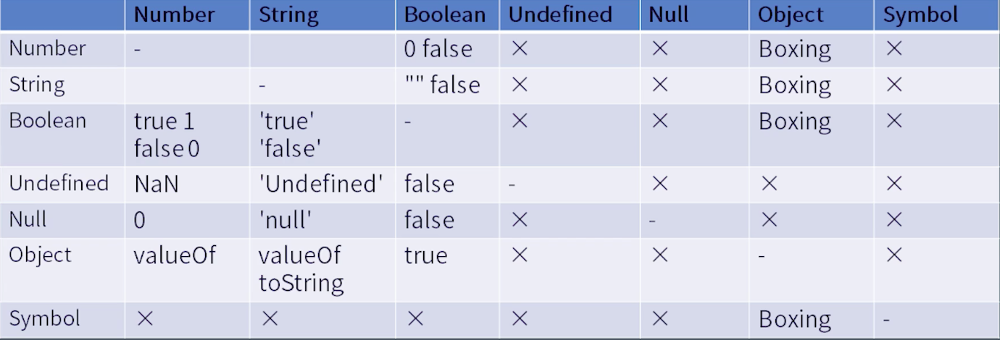

## 1. JS表达式
### 1.1 运算符和表达式
#### 语法树和优先级的关系
* 高优先级形成较低一级的语法结构，一般是子树；
* 低优先级形成较高一级的语法结构，一般是父树。
#### 运算符优先级顺序
> 注：以下从 (1)～(15) 优先级依次降低

**(1) Member运算（优先级最高）**
* `a.b`    成员访问
* `a[b]`    成员访问，b可以是字符串
* foo\`string\`   反引号的字符串作为参数传入前面的函数
* `super.b` class中的构造函数中使用
* `super[ 'b' ]` class中的构造函数中使用
* `new.target` 写法固定
* `new Foo()` 带括号

> **扩展： Reference运行时类型（由a.b扩展出，例如常见的delete a.b）**
(1)含义：Reference存在于运行时，属于标准中的类型，而不是语言中的类型。
(2)它的构成： Object 和Key (这个key既可以是String类型的值，也可以是Symbol类型的值)
既有object,也有key,一个Reference完全记录了一个merber运算的前半部分和后半部分
(3)常见的Reference运算：
> * `delete` 需要知道删除的是哪一个对象的哪一个key，这时候需要用到Reference类型
> * `assign` 需要知道把等号右边的值赋值给哪一个对象的哪一个属性。例如a+=3等

**(2) new Foo运算（不带括号）**
不带括号的new Foo运算比带括号的new Foo()运算的优先级要低，
(1) new a()() 
因为new a()的优先级高，所以先计算new a()，在计算后面的括号
(2) new new a()
因为new a()的优先级高，所以先结合后面的new a()，再与前面new结合

**(3) Call运算**
* `foo()`
* `super()`
* `foo()['b']`
* `foo().b`
* foo()\`abc\`

最后3个call表达式的后面取属性的Member操作被Call拉低了优先级。例如：
(1)new a()['b']
new a()先结合再取属性['b']，而不是a()['b']先结合再new, 因为 new a()的优先级比a()的优先级要高

语义：new出了一个新对象，访问它的b属性


**(4) 左值计算和右值计算**
左值计算:只有左值运算符才能放到等号左边,例如: a.b
右值计算:只能放在等号右边,例如 a+b，a++

**(5) 自增自减运算(Update)**
* `a++`
* `a--`
* `++a`
* `--a`

++a++是右结合的，相当于++(a++)，但是无论怎样，该语法都是不合法的

**(6) 单目运算(Unary)**
* `delete a.b`  delete后面必须是个Reference才能生效
* `void foo()` 都返回undefined，类似空白或回车
* `typeof a` 检测类型
* `+a` +不会改变表达式的值 
* `-a`
* `~a` 位运算，把整数按位取反
* `!a` 非运算，用两个叹号!!将任何数据强制转换成boolean类型，!!a
* `await a`

**(7) \*\*运算符**
`**运算符`是唯一 一个右结合，表示乘方，，例如: 3\*\*2\*\*3 相当于 3\*\*(2\*\*3）

**(8) 乘除运算(multiplicative)**
* `*` 乘
* `／` 除
* `%` 取余

**(9) 加减运算(additive)**
* `+` 加，可以表示两个数相加，也可以连接字符串。
* `-` 减

**(10) 移位运算(shift)**
* `<<` 左移 
* `>>` 右移 
* `>>>` 带符号的右移 

**(11)关系比较运算（Relationship）**
* `>` 大于
* `>=` 大于等于 
* `<` 小于
* `<=` 小于等于
* `instanceof`
* `in`


**(12) 相等运算(equality)**
* `==`
* `!=`
* `===`
* `!==`

**(13) 位运算（Bitwise）**
* `&` 按位与 
* `|` 按位或
* `^` 异或

**(14) 逻辑运算（logical）**
存在短路原则，不能保证其中所有的表达式都被执行
* `&&` 逻辑与
* `||` 逻辑或

**(15) 条件运算(conditional)**
`expression? result1: result2`

### 1.2 类型转换

**装箱转换**
含义：基本类型转为Object（除了undefined和null）
Object给基本类型的值提供了一个包装的类，使用包装的类之后，生成的是一个对象。

具体转换：
* Number： new Number(1)
* String： new String("a")
* Boolean： new Boolean(true)
* Symbol： new Object(Symbol("a"))

> 使用点或者方括号访问对象属性的时候，如果点或者方括号之前是基本类型，在访问属性的时候会自动调用对应的装箱过程会自动调用装箱。可以通过 typeof 判断是装箱后的对象，还是包装前的基本类型值

**拆箱转换**

含义：把Object类型转化成基本类型
重要过程：ToPrimitive，只要Object参与运算，就会调用 ToPrimitive
一个对象o涉及到的三个方法定义：
* valueOf()
* toString()
* Symbol 的 ToPrimitive()

如果定义了Symbol.toPrimitive(), 就会忽略valueOf() 和toString()
 
## 2. JS语句
#### 2.1 运行时
**完成记录 （Completion  Record）**
```
if(x==1){
    return 10;
}
```
根据x的值，有可能有return或者没有return。
js引擎解析语句需要一种数据结构记录一下语句完成的结果(怎么完成的,是否返回了，返回值是啥..)；不能访问到这个数据，不能赋值给变量，存在于运行时。

Completion  Record是一种运行时的类型,描述语句的执行结果
构成：
* [[type]] ：normal 、 break 、continue、  return 、throw 
* [[value]] ： 基本类型值
* [[target]]： label


#### 2.2 简单语句和复合语句
**简单语句**
* `表达式语句` 表达式后面跟分号，形成表达式语句
* `空语句` 单独一个分号，就是一个空语句
* `debugger语句` debugger加分号，形成debugger语句，触发断点，用于调试
* `throw语句` 抛出异常，可以主动抛出错误：throw+空格+表达式
* `continue语句` 结束当次循环，后面的循环继续
* `break语句` 结束整个循环
* `return语句` 一定在函数中使用，返回函数的值

"break语句" 和 "return语句"返回的完成记录的类型都是 [[type]]: break、continue

**复合语句**
* `块结构语句`
* `if 语句`  分支结构，条件语句
* `switch语句` 多分支结构，多条件语句，返回类型[[type]]: break、continue
* `循环语句` 返回类型[[type]]: break、continue
    * while(...){...}
    * do{...}while(...)
    * for(  ;  ;  ){....}
    * for(x in obj){...}
    * for(x of obj){.....}
* `with语句`
* `labelled语句` 给语句起名字，可给任何语句使用，返回类型[[type]]: break、continue
* `try 语句` try catch finally 三个结构，返回类型：[[type]]: return

#### 2.3 声明
* `变量声明`： var既有声明的作用，又有实际的执行计算的能力
* `函数声明 ` function 
* `Generator声明` function *
* `异步函数声明` async function
* `异步Generator声明` async function*
* `类声明` class
* `作用域声明`：let和const（声明之前使用会报错，有预处理操作）

> 拓展：预处理
在一段代码执行之前，js引擎会对代码本身做一次预先处理
作用:
>* 将var声明的变量进行提升，升到函数的作用级别(当前作用域最顶端)
>* 预处理const声明，暂时性死区


> 拓展：作用域
>* var声明的变量，其作用域是函数体，会穿透if和for语句
>* let／const 声明的变量，其作用域是花括号，花括号外使用会报错

## 3. JS结构化
#### 3.1 宏任务和微任务
**事件循环**

事件循环的3个过程：
* 等待
* 获取代码
* 执行

宏任务在下一个事件循环执行；
微任务在当前事件循环的最后执行。

常见宏任务：setTimeout、setImmediately、setInterval
常见微任务：Promise $nextTick

#### 3.2 函数调用
相关概念：调用栈、执行上下文栈
执行上下文(家族)
* `code  evalution  state `：用于async和generator函数的，保存代码执行到的位置
* `Function` 由function初始化的区域
* `Script or Module` Script 或者 Module的区域
* `Generator` Generator所生成的隐藏的区域 
* `Realm` 保存着所有内置对象的区域
* `LexicalEnvironment` 保存变量的区域
    * this
    * new.target
    * super
    * 变量
* `VariableEnvironment` 仅仅处理var声明变量，需要将变量声明到哪里的一个区域
