# 1. CSS排版

## 1.1 盒


### 相关概念理解
* 标签
* 元素
* 盒

HTML代码中可以书写开始`标签`，结束`标签` ，和自封闭`标签` 。
一对起止`标签`，表示一个`元素`.
DOM树中存储的是`元素`和其它类型的节点（Node）。
CSS选择器选中的是`元素`。
CSS选择器选中的`元素` ，在排版时可能产生多个`盒`（比如因为伪元素产生了多个盒，或者inline属性值产生了多个盒）
排版和渲染的基本单位是`盒` 。

### 盒模型
* content(内容)
* padding(内边距):影响盒内的排版，决定了盒内可排布的content区域的大小
* border(边框):
* margin(外边距): 影响盒本身的排版，决定了盒周围至少存在的空白区域的大小

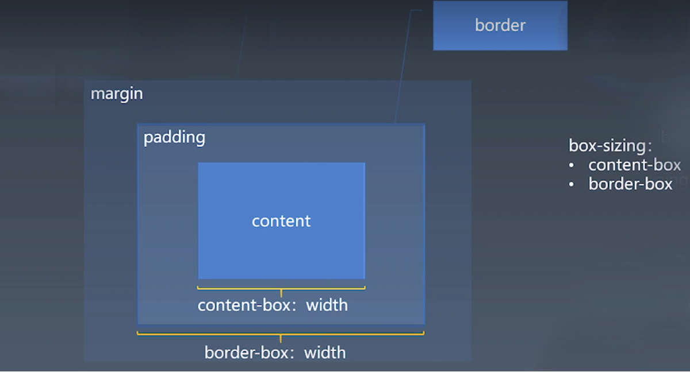

关于宽度：可以通过box-sizing属性设置，其值是：
* `content-box`：
设置的width属性，只包含了content的内容；
盒排版所占的区块: width+2\*padding、2\*border、2\*margin

* `border-box`：
设置的width属性，包含了content、padding、border；
盒排版所占的区块就是：width+2*margin 


## 1.2 正常流

三代排版技术：
* 基于正常流 (能力最差、机制复杂)
* 基于flex （机制最简单）
* 基于grid  

> 在html中，无非就是把`盒`和`文字`放到正确的位置，主要排这两种形式。

### 正常流排版

跟平时书写文字的习惯完全一致：从左到右、同一行文字对齐、一行写满进行换行等

正常流排版步骤：
1. 收集盒进行(hang)
2. 计算盒和文字在行中的布局
3. 计算行的排布

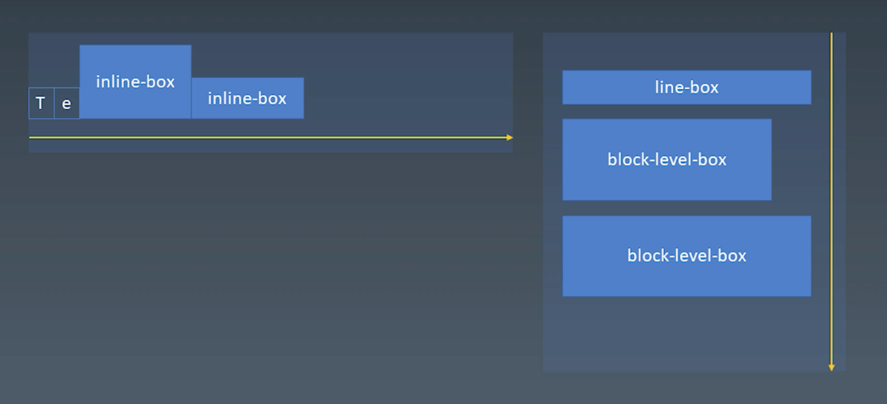
当盒和文字在同一个行里的时候，它们是从左到右排的，这样，文字和盒就有一个对齐规则，

`行内盒`：和文字在一行展示的图表、图标等形成的盒
`行盒(line box)`：行内盒和文字从左到右排布出来的盒
`块级盒`：单独占一行的盒。

> 一个正常流中，从上到下就是一个一个的行盒和块级盒构成的。

`IFC`：按照从左到右，排列行盒 （行内级格式化上下文：inline-level-formatting-context）
`BFC`：按照从上到下，排列行盒和块级盒 (块级格式化上下文：block-level-formatting-context)

## 1.3 正常流的行级排布
##### Baseline
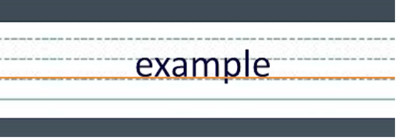
基线：对齐所依据的线，如图中橘色的线就是书写时的基线。

##### Text
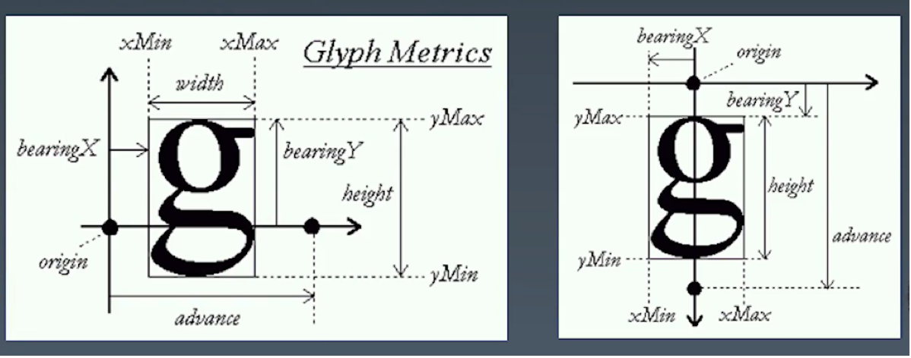

主要要素：
width：文字的宽度
height：文字的高度
origin：以源点作为坐标原点，定义文字的位置

##### 行模型
**基本文字排布：**
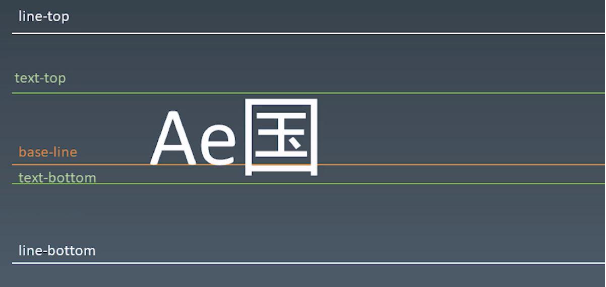
* line-top：行高大于文字时出现
* text-top: 文字上缘，依赖于字体大小；多个字体混排，由fontSize最大的一个字体决定
* base-line: 主要是以英文为主，用来指示对齐的线
* text-bottom: 文字下缘，依赖于字体大小；多个字体混排，由fontSize最大的一个字体决定
* line-bottom：行高大于文字时出现


**文字和盒混排：**
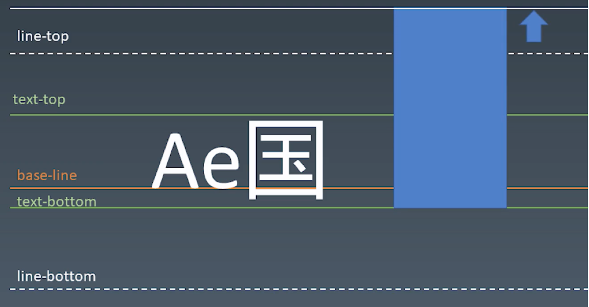

> **line-top和line-bottom偏移的问题：**
> 比如当盒(蓝色部分)足够大的时候，盒从text-bottom对齐的，这样盒就有可能把高度撑开了，这个时候line-top就从虚线的位置移到了白色实线的位置。

盒的先后顺序和盒的尺寸都会影响line-top和line-bottom的位置。

```
<body>
    <div style="font-size:50px;line-height:100px;background-color:pink;">
        <span>Hello good 中文</span>
        <div style="line-height:70px;
            width:100px;
            height:150px;
            background-color:aqua;
            display:inline-block;">
            b
        </div>
        
        <!-- 盒内部没有文字，文字基线和盒的下边缘对齐 -->
        <!-- 盒内部加上文字b，文字基线和盒里面文字的最后一行的基线（即b的基线）对齐，如图一 -->
        <!-- 盒内部加上文字b和(换行)c，文字基线和盒里面文字的最后一行的基线(即c的基线)对齐，如图二 -->
    </div>
</body>
```
图一：
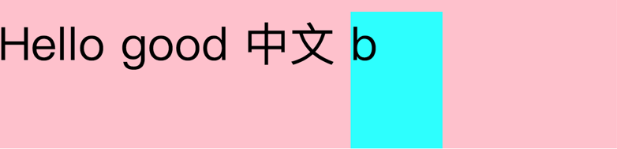
图二：
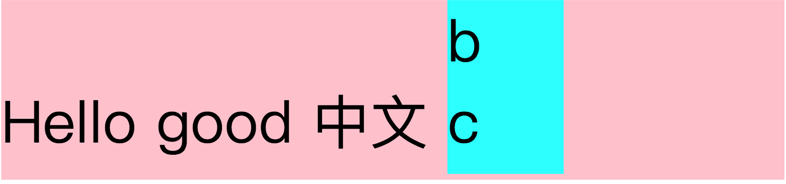

使用vertical-align指定对齐方式：
```
<body>
    <div style="font-size:50px;line-height:100px;background-color:pink;">
        <span>Hello good 中文</span>
        <div style="vertical-align:top;
            line-height:70px;
            width:100px;
            height:150px;
            background-color:aqua;
            display:inline-block;">
            b<br/>c
        </div>
        <!-- 盒内部有文字时，加上vertical-align属性，指定对齐方式 -->
        <!-- vertical-align:top; 按盒的顶部对齐 -->
    </div>
</body>
```
* `vertical-align:top;` 盒顶部对齐
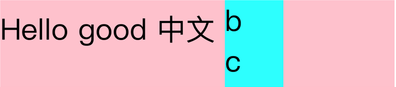
* `vertical-align:base-line;` 最后一行文字基线对齐
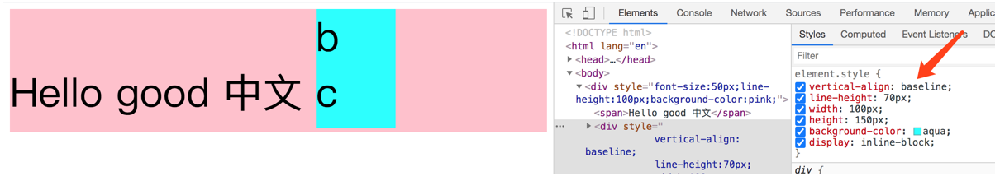
* `vertical-align:bottom;` 盒底部对齐
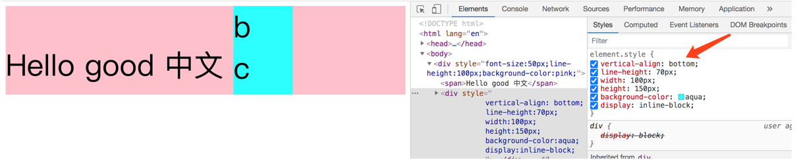
* `vertical-align:inherit;`  继承上一级的vertical-align属性
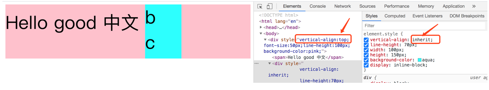

* `vertical-align:initial;` 
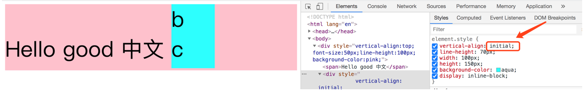

* `vertical-align:middle;` 文字上边缘和下边缘的中心和盒的垂直方向的中心对齐
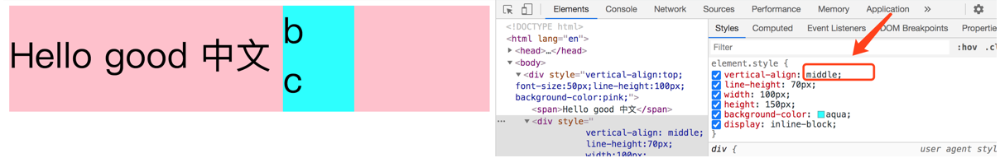
* 其他
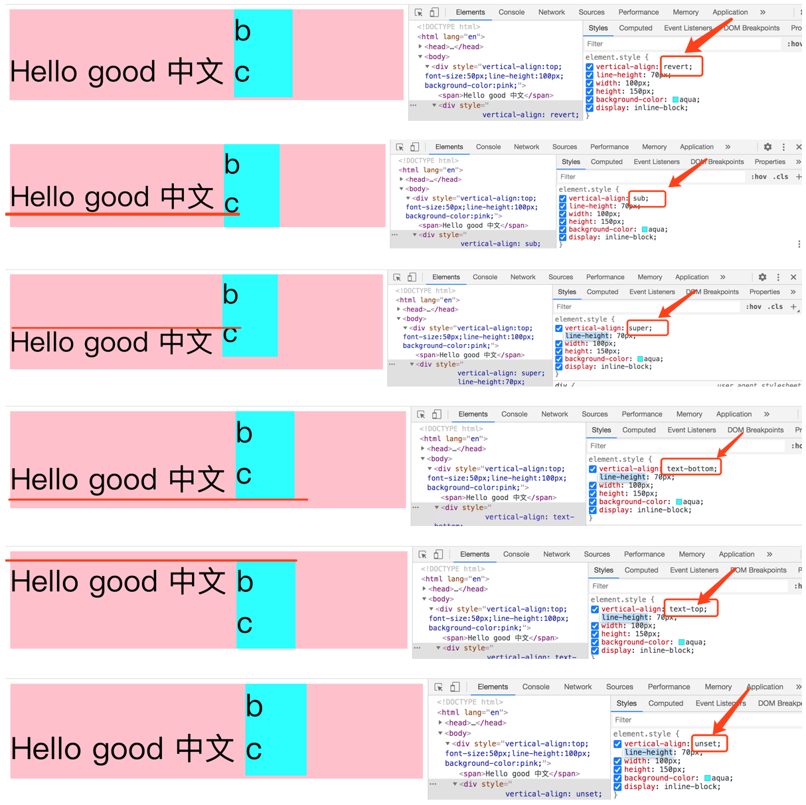

## 1.4 正常流的块级排布
##### float与clear

设置了float属性的元素就脱离了正常流，是依附于正常流定义的一类元素的排布方式；

**float产生的基本行为**：
* 行盒的宽度会根据float元素的宽度进行调整，会影响行盒的尺寸。
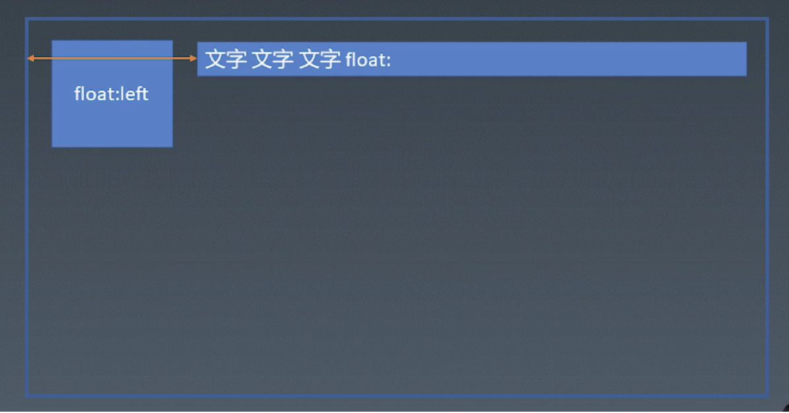

* float元素不只影响它所在的行，凡是它的高度所占据的范围内，所有的行盒都会根据float元素的尺寸进行调整。
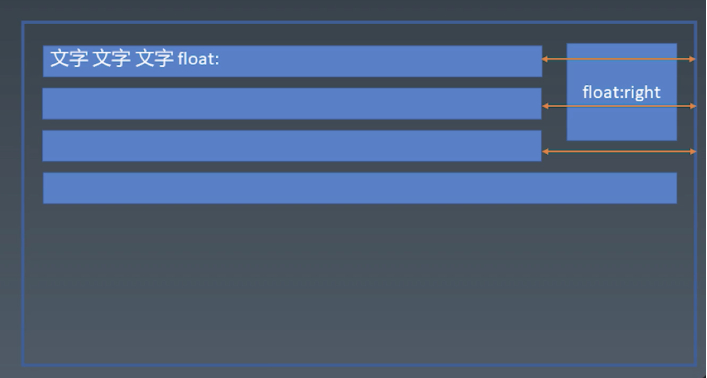

* 多个float元素，堆叠
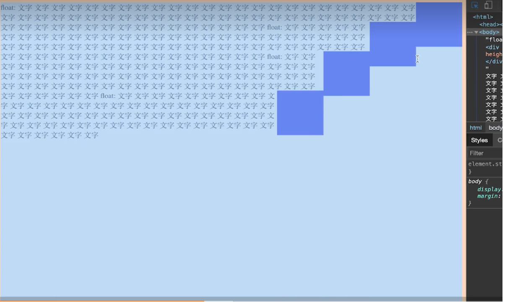

* clear属性，强制换行 (clear:right)

##### margin折叠
块级盒都有margin时，不是简单的margin相加，而是会发生堆叠，实际margin取决于较大的margin值；
> 注：margin重叠只会发生在正常流的BFC中，不会发生在IFC中。

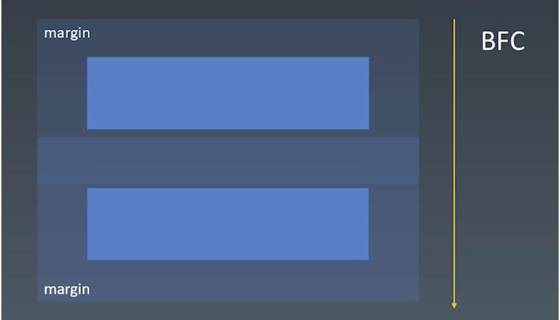

## 1.5 BFC合并
##### BFC相关概念
* `Block Container` 里面有BFC的（能容纳正常流的盒，里面就有BFC）
* `Block-level Box` 外面有BFC的
* `Block Box` 里外都有BFC的；即 Block Container + Block-level Box 

##### Block Container
Block Container表现出来的就是display属性展示的效果：
**display：**
* block
* inline-block
* table-cell
* flex item
* grid cell
* table-caption


##### Block-level Box
* `Block-level`
    * display:block;
    * display:flex;
    * display:table;
    * display:grid;
    * ...

* `inline-level`
    * display:inline-block;
    * display:inline-flex;
    * display:inline-table;
    * display:inline-grid;
* `display:run-in;`取决于自己的上一个元素

##### 创建BFC
可以创建BFC的情况：
* float
* 绝对定位的元素
* Block Container（inline-block;table-cell;table-caption,flex item;grid cell;等）
* block boxs with `overflow` other than `visile`

##### BFC合并
默认能容纳正常流的盒都能产生BFC，只有一种情况例外：
* block box && overflow:visible;
    * BFC合并与float
    * BFC合并与边距折叠

## 1.6 flex排版
**flex排版步骤：**
1. 收集盒进行；
2. 计算盒在主轴方向的排布；
3. 计算盒在交叉轴方向的排布；

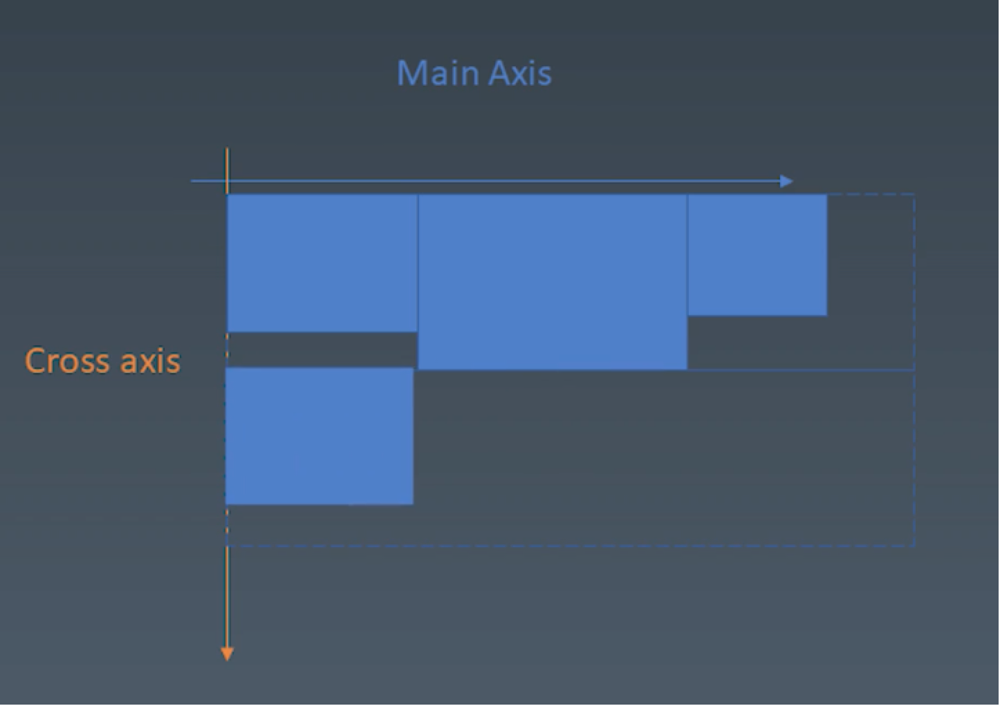
* 分行
    * 根据主轴尺寸，把元素分进行
    * 若设置了no-wrap，则强行分配进第一行
* 计算主轴方向
    * 找出所有flex元素
    * 把主轴方向的剩余尺寸按比例分配给这些元素
    * 若剩余空间为负数，所有flex元素为0；，等比压缩剩余元素。
* 计算交叉轴方向
    * 根据每一行中最大元素尺寸计算行高，
    * 根据行高flex-align和item-align，确定元素具体位置；

# 2. CSS动画与绘制
## 2.1 动画

##### animation
动画使用animation属性来实现。
* 使用@keyframes定义动画的关键帧
* 使用animation属性使用关键帧
```
@keyframes mykf {
    from { background-color:red;}
    to { background-color:yellow; }
}

div {
    animation: mkf 1s infinite;
}
```

animation属性组成：
* `animation-name` 时间曲线,即定义的keyframes
* `animation-duration` 动画时长
* `animation-timing-function` 动画的时间曲线
* `animation-delay` 动画开始前的延迟
* `animation-iteration-count` 动画的播放次数
* `animation-direction` 动画的方向

keyframes的定义：
* 可以使用from to（from 0%；to 100%）
* 可以使用百分比（使用技巧，在每个关键帧中，不使用animation-timing-function，而是transition属性）
```
@keyframes mykf {
    0% { top: 0; transition:top ease} 
    50% { top: 30px;transition:top ease-in } 
    75% { top: 10px;transition:top ease-out } 
    100% { top: 0; transition:top linear}
}
```

##### transition
transition使用只要一个transition属性就可以；
**transition属性组成：**
* `transition-property` 要变换的属性
* `transition-duration` 变换的时长
* `transition-timing-function` 时间曲线
* `transition-delay` 延迟

> timing-function
> 参考：[cubic-bezier](https://cubic-bezier.com/#.17,.67,.83,.67)
> 常见内置值：ease | linear | ease-in | ease-out | ease-in-out

## 2.2 颜色
##### CMY和RGB
人眼可见光范围：
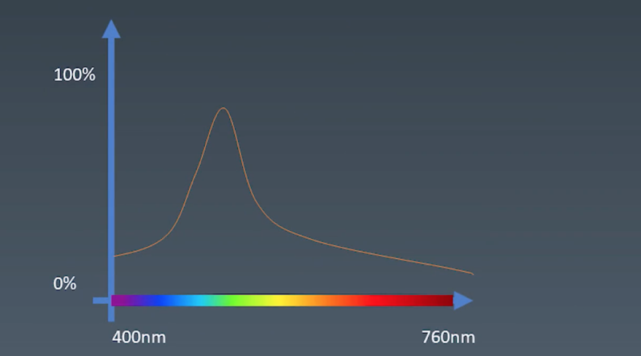

三原色：红、绿、蓝 (RGB)
三原色补色：品红、黄、青(CMY)
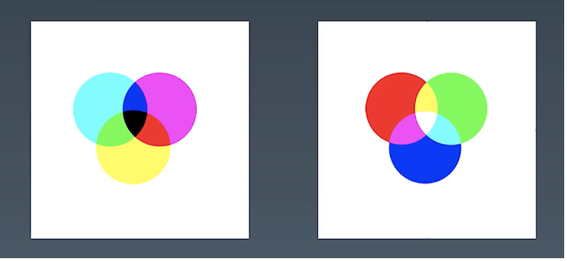

##### HSL和HSV

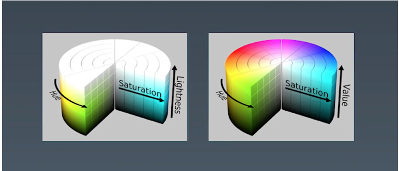
H：色相(Hue)
S：纯度，S越高颜色越鲜艳越漂亮
L：亮度(Lightness) --- 0:黑色 100:白色
V：明度(Brightness)

## 2.3 绘制

三类绘制：
* 几何图形
    * border
    * border-shadow
    * border-radius
* 文字
    * font
    * text-decoration
* 位图
    * background-image
    